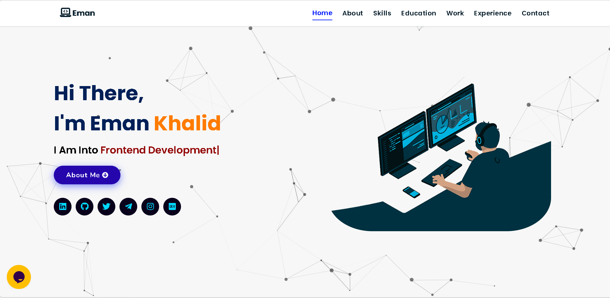

# 🚀 Eman Khalid – Portfolio Website


A modern, responsive **personal portfolio website** built to showcase my **projects, skills, and development journey**.

Designed with **smooth animations, interactive UI elements, and a clean professional layout** to create an engaging user experience.

### 🌐 Live Website

👉 **[View Portfolio](https://emankhalid.netlify.app)**

---

# ✨ Features

✔ **Modern Responsive Design** – Works perfectly across all screen sizes
✔ **Smooth Animations** – Powered by ScrollReveal and GSAP
✔ **Interactive UI** – Typing effects, hover tilt effects, and glassmorphism design
✔ **Particle Background** – Dynamic animated background using Particle.js
✔ **Project Showcase** – Projects dynamically loaded from JSON
✔ **Contact Integration** – Social links and functional contact section

---

# 🛠 Tech Stack

| Technology     | Usage                 |
| -------------- | --------------------- |
| **HTML5**      | Core structure        |
| **CSS3**       | Styling & layout      |
| **JavaScript** | Interactivity & logic |
| **jQuery**     | DOM manipulation      |

---

# ⚡ Libraries & Tools

**Animations**

* Particle.js
* Typed.js
* Vanilla Tilt.js
* ScrollReveal.js

**UI & Icons**

* Font Awesome
* Google Fonts

**Data Handling**

* JSON (skills & projects)

**Deployment**

* Netlify

---

# 📸 Website Preview



---

# 📂 Project Structure

```
Portfolio-Website
│
├── index.html           # Main entry point
├── skills.json          # Skills data
│
├── assets
│   ├── css              # Stylesheets
│   ├── js               # Custom scripts & libraries
│   ├── images           # UI images
│   ├── experience       # Experience Folder
│   └── projects         # Project Folder
│
└── README.md            # Project documentation
```

---

# 🚀 Installation & Setup

### 1️⃣ Clone the repository

```bash
git clone https://github.com/EmanKhalid27/portfolio-website.git
```

### 2️⃣ Navigate into the folder

```bash
cd portfolio-website
```

### 3️⃣ Run the project

Open **index.html** in your browser
OR use **Live Server** extension in VS Code.

---

# 📬 Connect With Me

[💼 **LinkedIn**](https://www.linkedin.com/in/-eman-khalid/)

[💻 **GitHub**](https://github.com/EmanKhalid27)

[📧 **Email**](mailto:emankhalidek.01@gmail.com)

---

# ⭐ Support

If you like this project, consider **starring ⭐ the repository** to support my work.

> **"Building innovative solutions with code and creativity."**
> — *Designed & Developed by **Eman Khalid***
